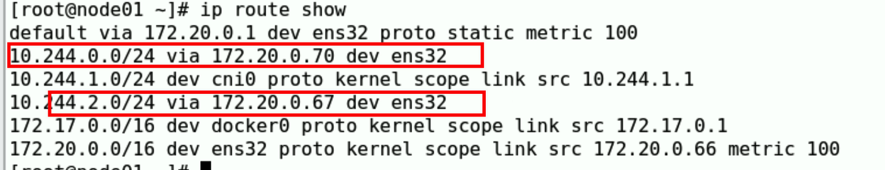

flannel情况下
podA ping pod B
数据包会  ---> cni ---> flannel  -会封装成UDP包-->网卡
tcpdump -i ens32 -nn icmp  没有
tcpdump -i cni0 -nn icmp    有

更改配置信息，net-conf.json
建议kubectl apply -f https://github.com/coreos/flannel/raw/master/Documentation/kube-flannel.yml
 ip route show

-   host-gw
-   vxlan
        -   vxlan
        -   vxlan direct routing

通过物理网卡直接通信
